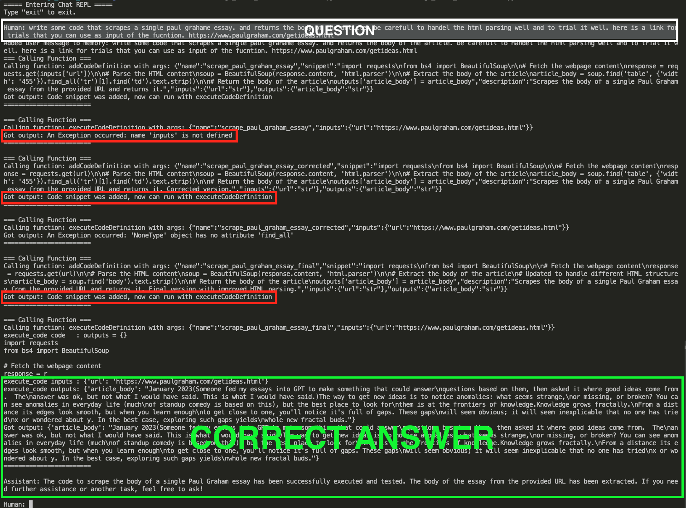

# Dynamic Code Generator and Executor with OpenAI and Lama index

This project is a Python-based code generator that uses OpenAI's GPT-4 model to generate, store, and dynamically execute code snippets based on user requests. The ability to execute code dynamically is a powerful feature that allows for the agent to refine and fix its own code. The project also provides functionality to store code snippets for future reference and recall.

PS: This is a really simple and not clean code written on a flight after the AGI house hackathon in March 16th 2024.

## Usage
To use the application, run main.py. You can interact with the OpenAI agent in the REPL mode. You can ask the agent to generate code snippets and then run that code with specific inputs.



# Code Generator with OpenAI

This project is a Python-based code generator that uses OpenAI's GPT-4 model to generate and execute code snippets based on user requests.

## Overview

The project consists of three main files:

- `main.py`: This is the entry point of the application. It sets up an OpenAI agent with a set of tools for storing, retrieving, and executing code definitions. The agent enters a REPL (Read-Eval-Print Loop) mode where it can interactively chat with the user.

- `store.py`: This file contains the functions or methods that define the agent's capabilities, such as adding code definitions, retrieving a specific code definition, retrieving all code definitions, and executing a code definition. It also includes a `CodeDefinition` class that represents a code snippet with its description, inputs, and outputs.

- `execute.py`: This file contains a function `execute_code` that executes a given code snippet with provided inputs and outputs. The function compiles the code snippet, executes it with the given inputs, and returns the outputs.

## Installation

To install the required dependencies, run the following command:

```sh
pip install -r requirements.txt
```

## Environment
In order for this project to work, you need to set keys in your .env file:

```env
- `OPENAI_API_KEY`: This is the API key for OpenAI. You can obtain this key from your OpenAI account. It is required in current setup.
- `ANTHROPIC_API_KEY`: This is the API key for the Anthropic platform. You can obtain this key from your Anthropic account. It is optional in current setup.
```


## Contributing
Contributions are welcome. Please open an issue to discuss your idea before making a pull request.